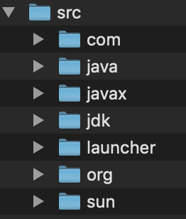
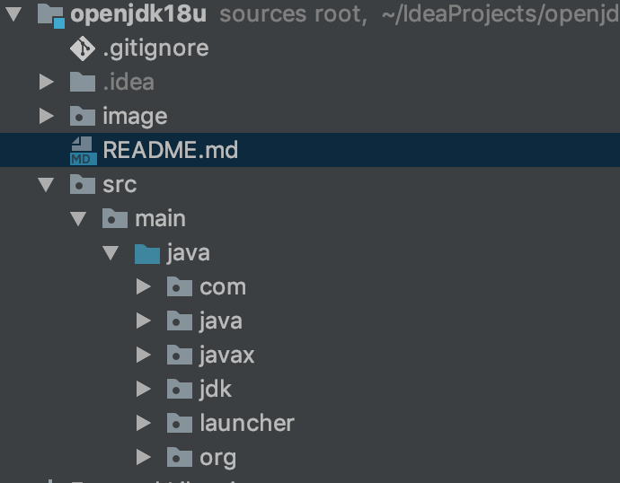
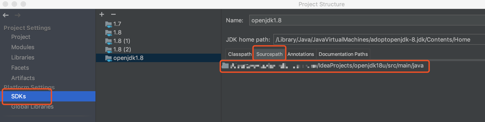

jdk rt.jar中的源码进行学习，查看，添加中文注释

jdk8 api地址：https://docs.oracle.com/javase/8/docs/api/

这里下载的是openjdk

opjdk下载地址

https://adoptopenjdk.net/archive.html?variant=openjdk8

这里下载的jdk版本是1.8，当然也可以下载其它版本

下载好后，安装jdk,jdk安装成功后，在安装目录下，有一个src.zip文件，这个是java源代码。解压src.zip文件，

在eclipse或idea中新建一个java项目，这里使用的是idea,把src下解压的文件拷贝到新建的java项目中

设置项目使用的jdk为下载的jdk,默认jdk关联的源码是jdk安装目录下的src.zip,这里需要修改关联的源码为当前工程中的代码

然后就可以在工程中写测试代码，点击进入的源码就是当前工程的代码，可以直接在当前工程的代码上添加汉字注释

分支chinese_annotation 是进行中文注释添加的分支

